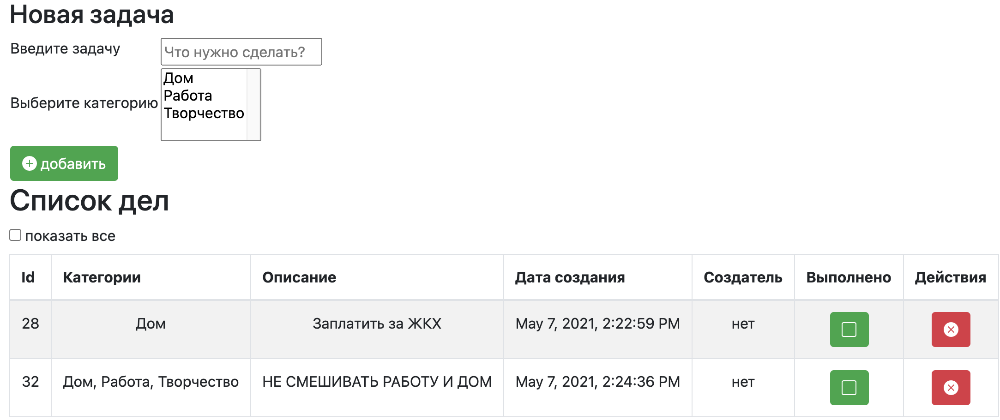
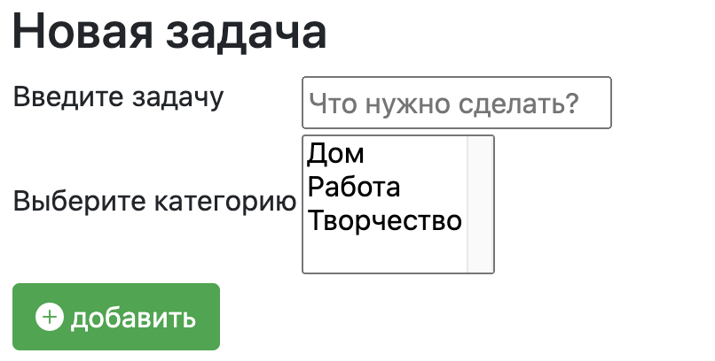
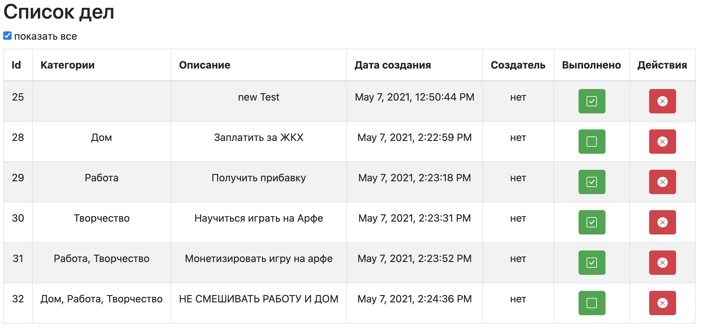
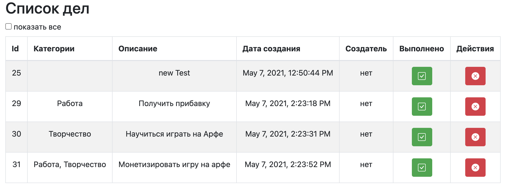
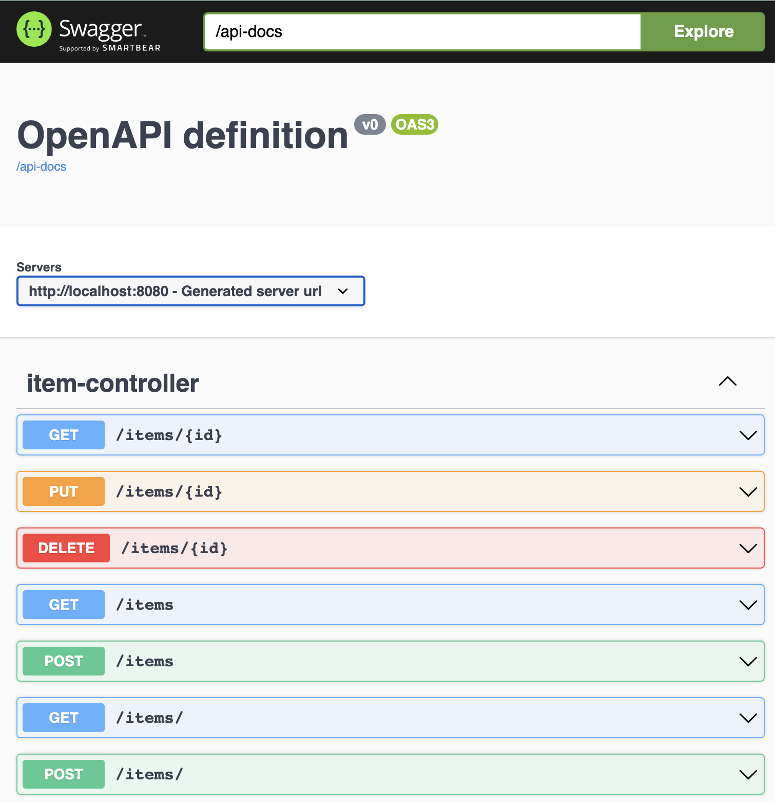
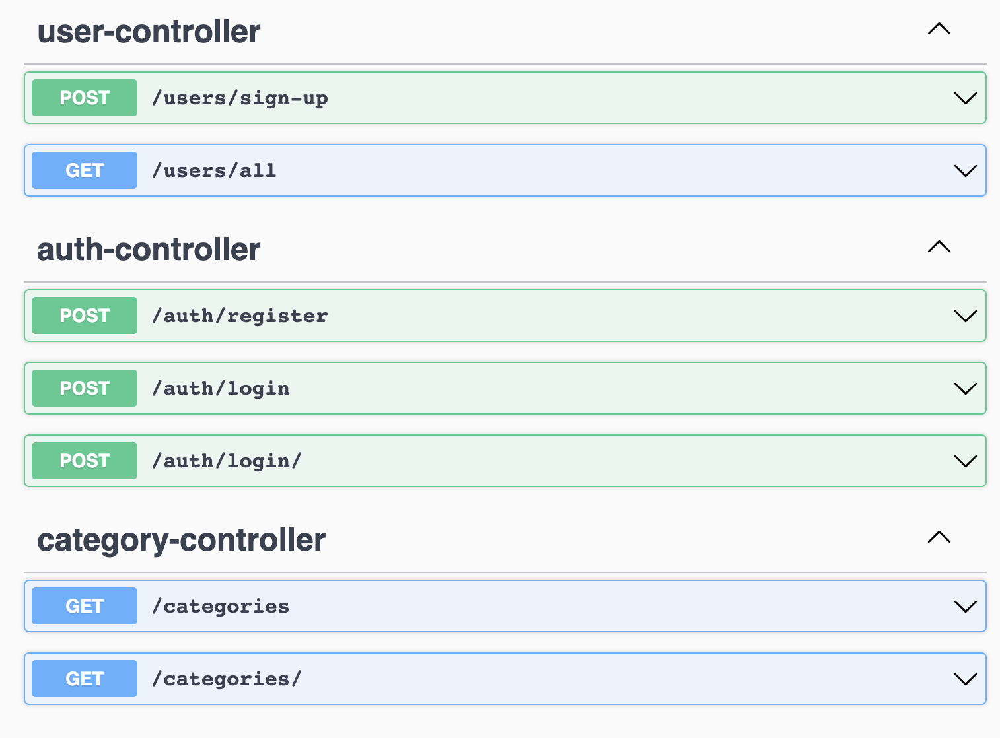

# Spring boot Web Todo List Web Application 

# Todo list Single Page Web application

## Functionality:

- Web Application Interface
- Create new Task Item
- Delete Item
- Update Item Done Status
- List All Items
- List Done Items

## Main Interface

### Add new Item interface

### List All Items

### List Done Items

### Swagger documentations:
### http://localhost:8080/swagger-ui/index.html?configUrl=/api-docs/swagger-config
 
 

